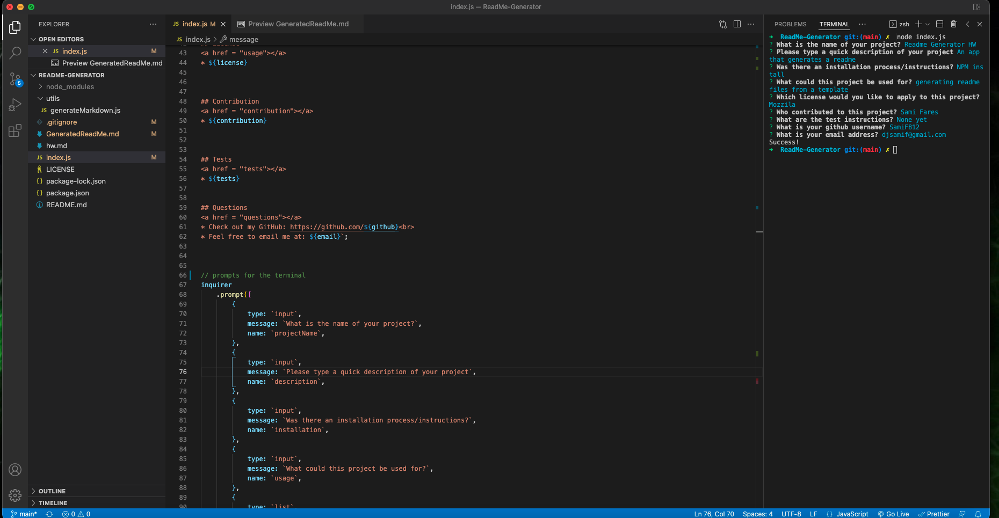
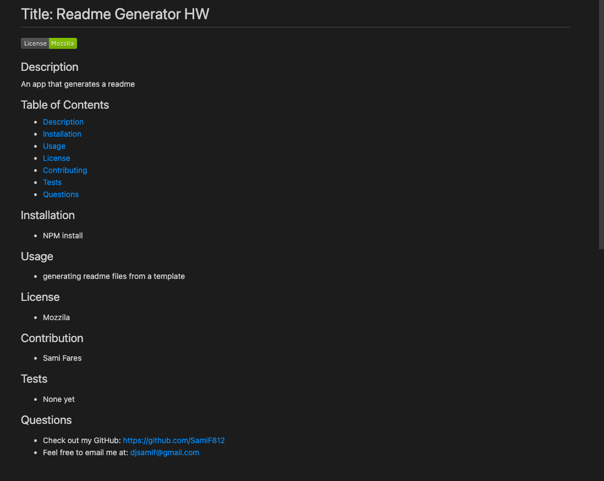

# ReadMe-Generator

# Links
GitHub Repo: https://github.com/SamiF812/ReadMe-Generator
Youtube Link to Demo: https://youtu.be/SBqDrXTC--0

# Description

Created an app that allows users to generate a Readme file. This is done using inquirer, the user is prompted in terminal. Once the prompts are given responses a new file is generated with their answers.

